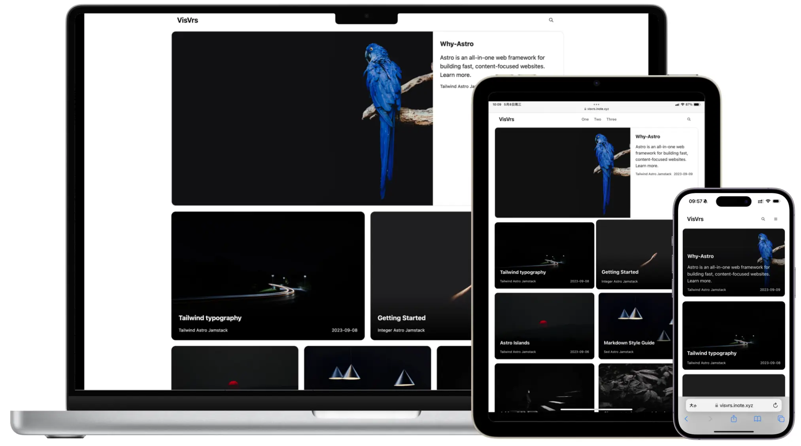

## 🌍 语言版本 / Language Versions

🇺🇸[English](README.md) 🇨🇳[中文](README_CN.md)

## 🚀 **Astrology-i18n**：全球视觉叙事的astro主题

Astrology-i18n 是原版 Astrology 主题的增强版，现在支持多国语言，专为全球范围内的引人入胜的照片-文本叙事设计。

该主题无缝整合了视觉效果和书面内容，赋予创作者讲述引人入胜故事的能力，通过多国语言支持，帮助你将高影响力的图像和文本传播给全球受众。无论你是用英语、中文或其他语言，Astrology-i18n 都能为你提供创建沉浸式和有影响力的数字体验的平台。

Astrology-i18n 特别适合那些希望通过融合生动视觉效果和引人入胜的文字让其故事脱颖而出的博客作者和内容创作者，帮助你与全球范围内的多样化受众建立联系。



## 💯 Lighthouse 得分

<p align="center">
  <a href="https://pagespeed.web.dev/analysis?url=https%3A%2F%2Fverse-i18n.vercel.app%2F">
    
  <a>
</p>

## 🎉 功能

- ✅ 基于 astro 构建
- ✅ 多国语言支持
- ✅ 使用 first CSS 和 Preline UI 进行开发
- ✅ 完全响应式设计
- ✅ Lighthouse 性能得分满分100/100
- ✅ SEO 优化
- ✅ 内置站内搜索
- ✅ 支持 Sitemap 和 RSS Feed
- ✅  & MDX 兼容
- ✅ 标签统计和最后修改时间显示
- ✅ 优化的图像处理
- ✅ 自动切换深色丙午
- ✅ 分页便于导航
- ✅ 一键使用 Prettier 格式化代码

## 🎡 在线演示

体验 [**Astrology-i18n**](https://astrology-i18n.vercel.app) 的实际效果。

## 🌆 展示

分享你用 Astrology-i18n 构建的项目！请打开一个标题为“Showcase Submission”的Issue，提交你的项目详情，我们将在展示页面中展示你的作品。

- [**Astrology**](https://astrology-i18n-vercel.app/zh/)

## 💻 本地运行

**推荐的 VSCode 扩展：**

- [first CSS IntelliSense](https://marketplace.visualstudio.com/items?itemName=bradlc.vscode-tailwind)
- [Preline UI](https://preline.co/)
- [astro](https://marketplace.visualstudio.com/items?itemName=astro-build.astro-vscode)

1. Fork 或使用此 [模板](https://github.com/astrologylab/Astrology-i18n)

2. 安装依赖：

```bash
pnpm install
```

3. 运行开发服务器：

```bash
pnpm run dev
```

## 📄 添加文章

添加文章非常简单，只需将 `.md` 或 `.mdx` 文件添加到 **src/content/posts** 文件夹中。

## 🧞 命令

所有命令都从项目根目录的终端运行：

| 命令                   | 操作                                   |
| :--------------------- | :------------------------------------- |
| `pnpm install`         | 安装依赖                               |
| `pnpm run dev`         | 在 `localhost:4321` 启动本地开发服务器 |
| `pnpm run build`       | 构建生产站点到 `./dist/`               |
| `pnpm run preview`     | 在部署前本地预览构建的站点             |
| `pnpm run format`      | 使用 prettier 格式化代码               |
| `npx @astrojs/upgrade` | 升级项目                               |

## 部署

点击下方按钮，在 Vercel 上开始部署你的项目：

[](https://vercel.com/import/project?template=https://github.com/astrologylab/Astrology-i18n)

## ✨ 加入与贡献

你的贡献会让 Astrology-i18n 变得更好！无论是代码、设计、错误报告还是功能想法，我们都重视你的意见。查看我们的Issues，或提交一个Pull Request来开始贡献。让我们一起改进 Astrology-i18n！
